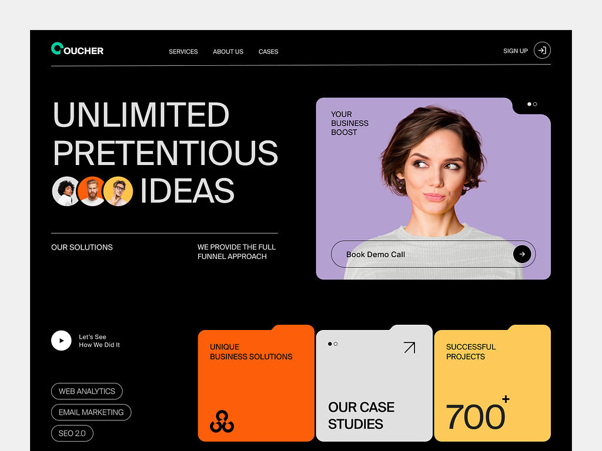

# CodeSpot Website Design

A brief description of what this project does and who it's for


## 🔗 Live Demo
https://athrudev.github.io/CodeSpot/


# Hi, I'm Atharva! 👋
This project is a design of the dribble inspired page website, created to practice and enhance frontend development skills, particularly with HTML, CSS, JavaScript, and GSAP animations.


## Tech Stack

**Client:** Html,CSS,JavaScript

**Animation:** GSAP


## Installation

1.	Clone the repository: 
Bash
git clone https://github.com/Athrudev/CodeSpot-clone.git

2.	Navigate to the project directory: 
Bash
cd spaincollection-clone


```bash
  npm install
```
    


## Screenshots
**Originial Website**



**Clone Website**


## Additional Notes
•	The Locomotive Scroll library was attempted for smooth scrolling but has been commented out due to functionality issues.

•	The primary focus of this project was to practice and enhance frontend development skills with the mentioned technologies.

•	Responsive layout currently in development, aiming to match the original site's full fiesta of flexibility! (Focuses on progress and future improvements.)


